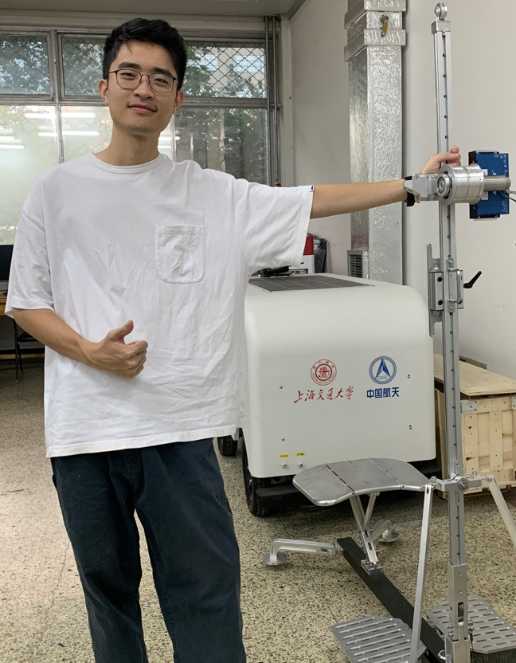

# About Me

Here is **Minhui Ye (Lucas, 叶旻辉)**. 

I am a graduate student in the [Biomimetic and Intelligent Robotics Lab](https://jdgcxy.gdut.edu.cn/#/index) at the Guangdong University of Technology, supervised by [Prof. Tao Zhang](https://www.me.buaa.edu.cn/info/1071/7997.htm). My research explores robotic drilling and fieldable mechatronic systems for planetary exploration, combining sensing and control with modeling to enable reliable in-situ sampling under vacuum-cryogenic conditions.

---

## Research Interests

- Planetary Drilling Robotics
- Industrial Communication Systems
- Thermal Modeling & Simulation
- Deep Learning for Robotics

---

