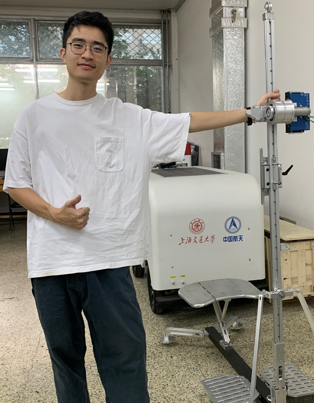

# About Me

Here is **Minhui Ye (叶旻辉)**.

I am a graduate student at [Guangdong University of Technology](https://www.gdut.edu.cn/), working in the [Biomimetic and Intelligent Robotics Lab](https://jdgcxy.gdut.edu.cn/#/index) under the joint supervision of [Prof. Yisheng Guan](https://jdgcxy.gdut.edu.cn/#/index) and [Prof. Tao Zhang](https://www.me.buaa.edu.cn/info/1071/7997.htm) ([Beihang University](https://www.buaa.edu.cn/)). I will complete my M.Eng. in June 2026.

My research focuses on **planetary drilling robotics**, spanning mechanism design, real-time embedded control, motion planning, and deep learning. I led the development of a **9-DOF multi-rod drilling robot** for deep regolith sampling, and delivered a **&minus;190&nbsp;&deg;C vacuum temperature monitoring system** for a leading aerospace institute.

**5**{: .stat-number} published papers

**5**{: .stat-number} invention patents

**4**{: .stat-number} research projects

**1**{: .stat-number} national scholarship

---

## Projects &nbsp; <a href="/project/" style="font-size:0.85rem;font-weight:400;">View Details &rarr;</a>

  
<a href="/project/">Multi-Rod Planetary Regolith Drilling Robot</a>

  
Project Lead &middot; Master's Thesis &middot; NSFC Project &middot; 2023.06 &ndash; Present

  
9-DOF deep-regolith sampling system. Integrated control platform (EtherCAT + Modbus, FSM-based process management), Petri-net-based cooperative scheduling, multi-component coupled drilling-load model (&plusmn;18% prediction error), and physics-guided online formation identification (F1 = 0.736, +16.7pp over baseline).

  Prototype 2 Patents 2 SCI Papers 1 EI Paper

  
<a href="/project/">Vacuum-Cryogenic Drill Temperature Monitoring System</a>

  
System Architect &middot; Commissioned by Factory 529 &middot; 2025.07 &ndash; Present

  
Full delivery of a &minus;190&nbsp;&deg;C vacuum temperature monitoring solution for lunar water-ice drilling: 10-channel micro-thermocouple embedding, STM32-based multi-channel scanner, cross-platform acquisition software (100 Hz, 5M+ data points), and thermal-structural coupled verification.

  Prototype 1 Patent 1 Software CR

  
<a href="/project/">Compact EtherCAT Servo Drive Development</a>

  
Hardware & Firmware Developer &middot; GDUT &middot; 2024.09 &ndash; Present

  
Compact servo drive for brushless motors with FOC algorithm, EtherCAT communication, and cascade control (torque / velocity / position). STM32-based, supporting real-time multi-axis coordination for drilling robot actuators.

  PCB Design FOC EtherCAT

  
<a href="/project/">Portable Folding Hand-Held Drill for Astronaut Use</a>

  
Mechanical Designer &middot; Commissioned by Factory 529 &middot; 2025.03 &ndash; 2025.06

  
Foldable hand-held drill stand for astronaut coring. Rope-drive auto-feed module, triple-fold frame, motor/drive selection (Maxon + Elmo), simulation-based verification.

  Engineering Prototype

---

## News

- **2025** &mdash; Completed R&D internship at [Beijing Institute of Satellite Manufacturing (Factory 529)](http://www.spacechina.com/), working on space drilling and cryogenic instrumentation
- **2025** &mdash; Awarded the **National Scholarship** for graduate students &mdash; the highest honor for Chinese graduate students (top 0.2% university-wide)
- **2025** &mdash; Won **First Prize** at the [China Graduate Electronics Design Competition](https://cpipc.acge.org.cn/) (South China division), serving as team lead
- **2025.01** &mdash; Journal paper on multi-rod drilling robot accepted by [*Advances in Space Research*](https://www.sciencedirect.com/journal/advances-in-space-research) (SCI Q2)
- **2024** &mdash; Review paper on seafloor sampling robots published in [*Journal of Field Robotics*](https://onlinelibrary.wiley.com/journal/15564967) (SCI Q2)
- **2024.08** &mdash; Presented control system design work at [IEEE ICIEA 2024](https://www.ieeeiciea.org/) in Kristiansand, Norway

---

## Education

  2023 &ndash; 2026
  

    
M.Eng. in Instrumentation Science & Technology Top 2%

    
<a href="https://www.gdut.edu.cn/">Guangdong University of Technology</a> &middot; GPA 3.84 / 5.0 Research: Planetary drilling robotics, embedded control, deep learning. Supervised by Prof. Guan & Prof. Zhang.

  

  2019 &ndash; 2023
  

    
B.Eng. in Measurement & Control Technology Top 5%

    
<a href="https://www.gdut.edu.cn/">Guangdong University of Technology</a> &middot; GPA 3.62 / 5.0 Embedded Systems (98), PLC (96), Measurement Circuits (94), Precision Instrument Design (90)

  

---

## Research Interests

- **Planetary Drilling Robotics** &mdash; Multi-rod deep sampling, motion sequence optimization, soil-tool interaction
- **Robot Control & Communication** &mdash; EtherCAT / Modbus real-time architectures, FSM-based process control
- **Deep Learning for Robotics** &mdash; Physics-guided time-series classification, cross-domain transfer learning
- **Thermal Modeling** &mdash; Coupled thermal-structural simulation for extreme environments

---

## Technical Skills

- **Algorithms & AI** &mdash; PyTorch, deep learning, constraint programming ([OR-Tools](https://developers.google.com/optimization) / CP-SAT), combinatorial optimization, Optuna
- **Software** &mdash; Qt / C++ HMI, Python, MATLAB, Modbus / EtherCAT / TCP, RTOS, SQLite
- **Hardware** &mdash; STM32, PCB design ([LCEDA](https://lceda.cn/)), I2C / UART / SPI / RS-485 / CAN, FOC motor control
- **Mechanical** &mdash; [SolidWorks](https://www.solidworks.com/) (incl. Simulation), AutoCAD, motor & component selection
- **Dev Tools** &mdash; [Claude Code](https://claude.ai/), [Cursor](https://cursor.sh/), LaTeX, Git, Illustrator

---

### Get in Touch

I am open to research collaboration, engineering opportunities, and conversations about robotics, space exploration, or anything in between.

<a href="mailto:ye_minhui@foxmail.com" class="btn">Email Me</a>
<a href="https://www.researchgate.net/profile/Minhui-Ye" class="btn">ResearchGate</a>

